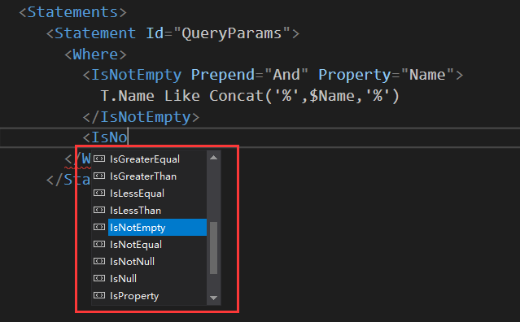

# Installation

## 安装 XML Schema File 文件获得智能提示



下载以下俩个文件至 Microsoft Visual Studio XSD安装目录

> VS2017目录地址：\Microsoft Visual Studio\2017\Enterprise\Xml\Schemas

| 文件      |   地址   |
| --------  | -----:  |
| SmartSqlMapConfig.xsd  | [SmartSqlMapConfig.xsd](https://raw.githubusercontent.com/Ahoo-Wang/SmartSql/master/doc/Schemas/SmartSqlMapConfig.xsd) |
| SmartSqlMap.xsd        |   [SmartSqlMap.xsd](https://raw.githubusercontent.com/Ahoo-Wang/SmartSql/master/doc/Schemas/SmartSqlMap.xsd)   |

## 安装 SmartSql & 相应的Db驱动，这里以MySql为例

``` chsarp
Install-Package SmartSql
Install-Package MySql.Data
```

## SmartSqlMapConfig.xml 模板

``` xml
<?xml version="1.0" encoding="utf-8" ?>
<SmartSqlMapConfig xmlns="http://SmartSql.net/schemas/SmartSqlMapConfig.xsd">
  <Settings
     IsWatchConfigFile="true"
  />
  <Database>
    <DbProvider Name="MySqlClientFactory" ParameterPrefix="?" Type="MySql.Data.MySqlClient.MySqlClientFactory,MySql.Data"/>
    <Write Name="WriteDB" ConnectionString="Data Source=localhost;database=SmartSqlStarterDB;uid=root;pwd=SmartSql.Net;CharSet=utf8;"/>
  </Database>
  <TypeHandlers>
    <TypeHandler Name="Json" Type="SmartSql.TypeHandler.JsonTypeHandler,SmartSql.TypeHandler"/>
    <TypeHandler Name="Xml" Type="SmartSql.TypeHandler.XmlTypeHandler,SmartSql.TypeHandler"/>
  </TypeHandlers>
  <SmartSqlMaps>
    <SmartSqlMap Path="Maps" Type="Directory"></SmartSqlMap>
  </SmartSqlMaps>
</SmartSqlMapConfig>
```

## SmartSqlMap.xml 模板

``` xml
<?xml version="1.0" encoding="utf-8" ?>
<SmartSqlMap Scope="User"  xmlns="http://SmartSql.net/schemas/SmartSqlMap.xsd">
  <Statements>
    <Statement Id="QueryParams">
      <Where>
        <IsNotEmpty Prepend="And" Property="EqUserName">
          T.UserName=?EqUserName
        </IsNotEmpty>
        <IsNotEmpty Prepend="And" Property="UserName">
          T.UserName Like Concat('%',?UserName,'%')
        </IsNotEmpty>
      </Where>
    </Statement>
    <!--新增-->
    <Statement Id="Insert">
      INSERT INTO T_User
      (UserName
      ,Password
      ,Status
      ,LastLoginTime
      ,CreationTime)
      VALUES
      (?UserName
      ,?Password
      ,?Status
      ,?LastLoginTime
      ,?CreationTime)
      ;Select Last_Insert_Id();
    </Statement>
    <!--删除-->
    <Statement Id="Delete">
      Delete FROM  T_User
      Where Id=?Id
    </Statement>
    <!--更新-->
    <Statement Id="Update">
      UPDATE T_User
      <Set>
        <IsProperty Prepend="," Property="UserName">
          UserName = ?UserName
        </IsProperty>
        <IsProperty Prepend="," Property="Password">
          Password = ?Password
        </IsProperty>
        <IsProperty Prepend="," Property="Status">
          Status = ?Status
        </IsProperty>
        <IsProperty Prepend="," Property="LastLoginTime">
          LastLoginTime = ?LastLoginTime
        </IsProperty>
        <IsProperty Prepend="," Property="CreationTime">
          CreationTime = ?CreationTime
        </IsProperty>
      </Set>
      Where Id=?Id
    </Statement>
    <!--获取数据列-->
    <Statement Id="Query">
      SELECT T.* From T_User T
      <Include RefId="QueryParams"/>
      <Switch Prepend="Order By" Property="OrderBy">
        <Default>
          T.Id Desc
        </Default>
      </Switch>
      <IsNotEmpty Prepend="Limit" Property="Taken">?Taken</IsNotEmpty>
    </Statement>
    <!--获取分页数据-->
    <Statement Id="QueryByPage">
      Select T.*
      From T_User T
      <Include RefId="QueryParams"/>
      <Switch Prepend="Order By" Property="OrderBy">
        <Default>
          T.Id Desc
        </Default>
      </Switch>
      Limit ?Offset,?PageSize
    </Statement>
    <!--获取记录数-->
    <Statement Id="GetRecord">
      Select Count(1) From T_User T
      <Include RefId="QueryParams"/>
    </Statement>
    <!--获取表映射实体-->
    <Statement Id="GetEntity">
      Select T.* From T_User T
      <Where>
        <IsNotEmpty Prepend="And" Property="Id">
          T.Id=?Id
        </IsNotEmpty>
      </Where>
      Limit 1
    </Statement>
    <!--是否存在该记录-->
    <Statement Id="IsExist">
      Select Count(*) From T_User T
      <Include RefId="QueryParams"/>
    </Statement>
  </Statements>
</SmartSqlMap>
```